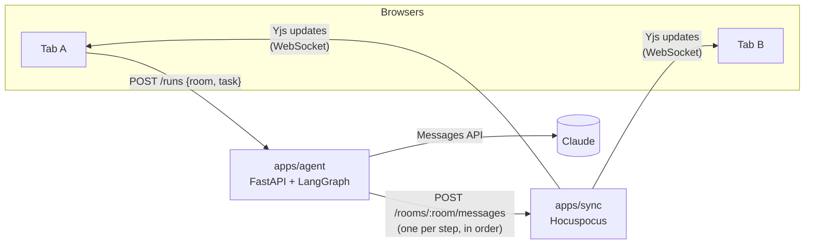

# bring-a-friend

A real-time collaborative workspace where multiple people share one live AI agent session. Everyone in a room watches the agent think, call tools and answer, as it happens. Think of it as a Google Doc, but for an AI agent.

**Status: Milestone 1.** A LangGraph research agent streams every step into a shared Yjs document. Every browser in the room sees the same timeline live, plus a list of who's connected. Pause, redirect and hand-off come next.

## Quick start

Prerequisites: Node 24+, [pnpm](https://pnpm.io) and [uv](https://docs.astral.sh/uv/) (`brew install pnpm uv`). uv installs Python 3.12 for you.

```bash
pnpm install
cp .env.example .env     # then set ANTHROPIC_API_KEY, or AGENT_MOCK_LLM=1 to run without one
pnpm dev                 # starts sync (:1234), agent (:8000) and web (:5173)
```

Open <http://localhost:5173/?room=demo> in **two browser windows**. Start a task in one, and both show the agent's steps appear together. Each tab gets its own name in the "In this room" list. A window opened later, while someone is still in the room, receives the full history.

Run the tests with `pnpm test` (sync server unit tests and agent tests; the agent tests use the mock model, so they need no API key).

## Architecture



1. **A browser starts a task** with a plain HTTP call to the agent. The response is only `{runId}`; the browser does *not* get progress back from this request.
2. **The agent runs a LangGraph graph.** After each node finishes, it turns that node's output into timeline events and POSTs them to the sync server, one at a time and in order.
3. **The sync server writes each message into the room's `Y.Doc`** through a Hocuspocus *direct connection*. Every connected browser receives the change as an ordinary Yjs update.
4. **Browsers render from the doc.** Yjs observers copy the doc's state into React state, so the tab that started the task and every other tab go through exactly the same code path.

### Repo layout

| Path | What it is |
|---|---|
| `packages/doc-schema` | TypeScript types and accessors for the shared doc and the agent→sync wire messages. The single source of truth for the doc's shape. |
| `apps/sync` | Hocuspocus server. Relays Yjs over WebSocket and exposes `POST /rooms/:room/messages` for the agent. `applyAgentMessage.ts` holds all doc-writing logic. |
| `apps/agent` | FastAPI + LangGraph. `graph.py` (state machine), `llm.py` (Claude and the mock model), `tools.py` (fake tools), `events.py` (node output → timeline events), `runs.py` (runs a task and publishes its steps), `main.py` (HTTP API). |
| `apps/web` | Vite + React + Tailwind. `useRoom.ts` joins a room; `Timeline`, `Presence` and `TaskForm` render it. |

### The shared document (one `Y.Doc` per room)

| Key | Yjs type | Contents |
|---|---|---|
| `run` | `Y.Map` | `{ id, task, status: running\|done\|error, startedBy, startedAt }` |
| `timeline` | `Y.Array` | Timeline events: `{ id, runId, type: thought\|tool_call\|tool_result\|final\|error, content, toolName?, args?, ts }` |
| *(awareness)* | not in the doc | `{ user: { name, color } }` per connected tab; this is presence |

## Design decisions

### Hocuspocus rather than y-websocket for the sync server

- **The y-websocket server is a minimal reference relay.** Adding auth, persistence or custom endpoints means patching it.
- **Hocuspocus is built for extension.** It has lifecycle hooks (`onAuthenticate`, `onChange`, `onStoreDocument`, `onRequest`, …) and ready-made persistence extensions (SQLite, Redis), so the next milestones become configuration, not a fork.
- **It lets server code edit a document.** `openDirectConnection(room)` edits a doc as if the server were a client, and the change is broadcast to everyone. The agent integration below depends on that.
- **Trade-off: protocol lock-in.** Hocuspocus adds its own framing on top of the Yjs protocol (it can carry several documents over one socket). So clients must use `@hocuspocus/provider`, and generic y-websocket clients, including Python ones, can't connect.

### The agent sends events to the sync server; it does not join the doc itself

The alternative was for the Python agent to join the doc as a real Yjs peer (via pycrdt).

| | Agent joins the doc (pycrdt) | **Agent POSTs events to the sync server (chosen)** |
|---|---|---|
| Who writes CRDT state | JS and Python | Only JS (the reference Yjs implementation) |
| Doc schema defined | Twice, kept in sync by hand | Once, in `packages/doc-schema` |
| Connection | Long-lived WebSocket from Python with reconnect logic | Stateless HTTP calls you can test with `curl` |
| Works with Hocuspocus | No (pycrdt-websocket speaks y-websocket) | Yes |
| Agent in presence | Native awareness entry | Derived from `run.status` |

- **What we gain:** one writer language, one schema, and an agent that stays an ordinary backend service unaware of CRDTs.
- **What we give up:** the agent is a *virtual* participant, not a true peer. It can't see changes to the doc by itself. When pause or redirect arrive, browsers will send those commands to the agent over HTTP (or the sync server's `onChange` hook will forward them). If the agent ever needs to *co-edit* content with humans, joining as a real peer becomes worth its cost.

### Calling the Anthropic SDK directly from LangGraph nodes (no LangChain wrapper)

- **The split of responsibilities is clean.** LangGraph owns orchestration: the state machine, streaming each node's output, and checkpointing. The official `anthropic` SDK owns the model call.
- **It avoids an adapter layer that lags API features** such as adaptive thinking and server-side fallbacks.
- **Checkpointing works with less code.** Graph state is a list of plain Messages API dicts, which serialize trivially, and that matters once checkpoints are persisted.
- **Model settings:**
  - The model comes from `ANTHROPIC_MODEL`, defaulting to `claude-opus-5`.
  - Adaptive thinking runs with `display: "summarized"`, so the model's reasoning summaries become the "Thought" entries on the timeline.
  - Server-side refusal fallbacks (`ANTHROPIC_FALLBACKS=default`) mean that if a model declines on policy grounds, another model answers in the same call.

### A two-node graph instead of a prebuilt agent

- **`agent ⇄ tools` is small enough to explain line by line.** It's also the graph that pause/resume attaches to: an interrupt *before* `tools` is the natural "approve this tool call?" checkpoint.
- **Each node's output becomes a streamed update** (`stream_mode="updates"`). That's what gives the timeline one entry per step.

### Ordering and consistency

- **The agent sends events one at a time, awaiting each POST.** So they reach the doc in the order they happened.
- **Each message is applied inside a single Yjs transaction.** Clients never see a half-applied step.
- **A new run replaces the previous timeline.** Events carry a `runId`, and the sync server drops events from a run that has already been replaced.
- **One run per room at a time.** The agent returns `409` for a second start request, and the UI also disables the button while a run is going.

### Timeline entries are plain JSON, not nested Y types

- **Steps are append-only and never edited**, so a `Y.Array` of plain objects is enough and keeps the code simple.
- **If we later stream text token by token**, a `content` field becomes a `Y.Text`.

### Presence uses Yjs awareness, with a per-tab identity

- **Awareness is Yjs' built-in channel for temporary state** (who's here, cursors). It isn't stored in the doc, and a client's entry disappears when it disconnects.
- **Identities live in `sessionStorage`**, so two tabs in the same browser show up as two people. A reload keeps your name.

### Tooling

- **pnpm workspaces for TypeScript and uv for Python**, with one root `.env` that all three apps read.
- **`pnpm dev` uses `concurrently`,** the simplest way to run three processes with labeled output. Turborepo or docker-compose would be overkill here.
- **Python is pinned to 3.12 for dependency compatibility.** The newest Python releases sometimes lack prebuilt wheels for the LangGraph/Anthropic dependency tree. Python version has no meaningful effect on latency here; that's dominated by model calls and the network.
- **pnpm's supply-chain defaults are kept on.** Only `esbuild` may run install scripts (`allowBuilds`), and very recently published packages are held back (which is why `yjs` resolves to 13.6.32: 13.6.33 was published the day this was written).
- **`AGENT_MOCK_LLM=1` swaps in a scripted model**, so demos and tests need no API key and cost nothing.

## Designed for pause/resume (not built yet)

- **Every run is already a LangGraph thread.** The graph is compiled with a checkpointer (`InMemorySaver`), and each run uses its own `thread_id`.
- **The planned path:**
  1. Swap in a persistent checkpointer (e.g. SQLite).
  2. Compile with `interrupt_before=["tools"]`, or call `interrupt()` in a node.
  3. Add `POST /runs/{id}/pause|resume` endpoints that resume the thread from its checkpoint.
  4. Add a `paused` value to `RunStatus` in the doc, so every client sees who paused it.
- **Redirect works the same way:** resume the thread with an extra user message.

## Known limitations (Milestone 1)

- **No persistence.** A room's doc lives in the sync server's memory. It's lost when the server restarts or once everyone leaves the room.
- **No auth.** The agent-message endpoint is unauthenticated, so both servers bind to `127.0.0.1` only.
- **The agent's state is per process:** the active-rooms lock and the checkpoints live in memory, so a restart forgets them.
- **The tools are fake.** They return canned data after a short delay so the timeline has something to show.
