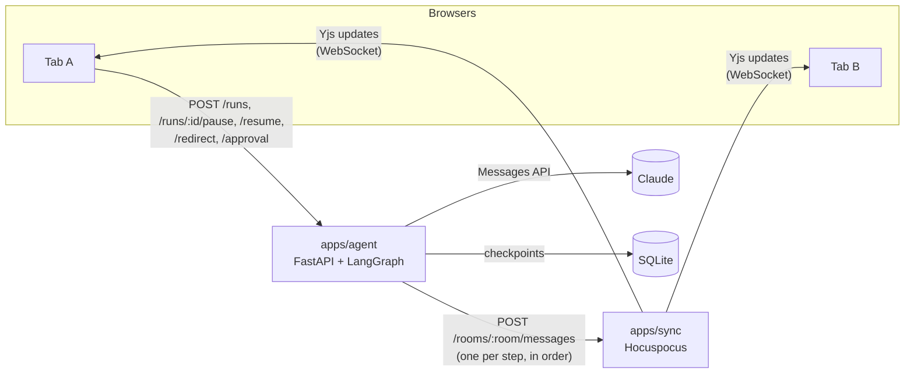

# bring-a-friend

A real-time collaborative workspace where multiple people share one live AI agent session. Everyone in a room watches the agent think, call tools and answer, as it happens. Think of it as a Google Doc, but for an AI agent.

**Status: Milestone 2.** A LangGraph research agent streams every step into a shared Yjs document, and anyone in the room can steer it: pause and resume it, add an instruction while it's paused, and approve or reject risky tool calls. Every action shows up on the shared timeline with the name of whoever took it. Paused runs survive an agent restart. Hand-off comes next.

## Quick start

Prerequisites: Node 24+, [pnpm](https://pnpm.io) and [uv](https://docs.astral.sh/uv/) (`brew install pnpm uv`). uv installs Python 3.12 for you.

```bash
pnpm install
cp .env.example .env     # then set ANTHROPIC_API_KEY, or AGENT_MOCK_LLM=1 to run without one
pnpm dev                 # starts sync (:1234), agent (:8000) and web (:5173)
```

Open <http://localhost:5173/?room=demo> in **two browser windows**. Start a task in one, and both show the agent's steps appear together. Each tab gets its own name in the "In this room" list. A window opened later, while someone is still in the room, receives the full history.

To try steering:

1. **Pause** from either window. The button shows "Pausing…" until the current step finishes.
2. **Add an instruction** while paused, then **Resume**.
3. When the agent wants to run `send_email`, both windows show an approval card. **Approve or Reject** it (clicking in both windows at once shows the losing side a 409 message).
4. To see persistence, stop the agent process while a run is paused, start it again, and click **Resume**.

Run the tests with `pnpm test` (sync server unit tests and agent tests; the agent tests use the mock model, so they need no API key).

## Architecture



1. **A browser starts a task, or steers one,** with a plain HTTP call to the agent. The response is only "accepted" (or a 409 explaining why not); the browser does *not* get progress back from this request.
2. **The agent runs a LangGraph graph.** After each node finishes, LangGraph saves a checkpoint to SQLite, and the agent turns that node's output into timeline events and POSTs them to the sync server, one at a time and in order. Status changes (pausing, paused, awaiting approval…) and participants' actions are sent the same way.
3. **The sync server writes each message into the room's `Y.Doc`** through a Hocuspocus *direct connection*. Every connected browser receives the change as an ordinary Yjs update.
4. **Browsers render from the doc.** Yjs observers copy the doc's state into React state, so the tab that started the task and every other tab go through exactly the same code path.

### Repo layout

| Path | What it is |
|---|---|
| `packages/doc-schema` | TypeScript types and accessors for the shared doc and the agent→sync wire messages. The single source of truth for the doc's shape. |
| `apps/sync` | Hocuspocus server. Relays Yjs over WebSocket and exposes `POST /rooms/:room/messages` for the agent. `applyAgentMessage.ts` holds all doc-writing logic. |
| `apps/agent` | FastAPI + LangGraph. `graph.py` (state machine and the redirect message), `llm.py` (Claude and the mock model), `tools.py` (fake tools; `send_email` is the risky one), `events.py` (Python mirror of the schema; node output → timeline events), `runs.py` (`RunManager`: every run's lifecycle and every command), `main.py` (HTTP API). Checkpoints live in `apps/agent/data/checkpoints.sqlite` (gitignored). |
| `apps/web` | Vite + React + Tailwind. `useRoom.ts` joins a room; `Timeline`, `Presence`, `TaskForm` and `RunControls` render it; `api.ts` sends requests to the agent. |

### The shared document (one `Y.Doc` per room)

| Key | Yjs type | Contents |
|---|---|---|
| `run` | `Y.Map` | `{ id, task, status, startedBy, startedAt, pendingApproval }`. `status` is `running`, `pausing`, `paused`, `awaiting_approval`, `done` or `error`; `pendingApproval` is `{ id, toolName, args }` while a risky call waits. |
| `timeline` | `Y.Array` | Timeline events: `{ id, runId, type, content, toolName?, args?, actor?, action?, ts }`. `type` is `thought`, `tool_call`, `tool_result`, `final`, `error`, `approval_request` or `human`; `human` events carry `actor` (who) and `action` (`pause`, `resume`, `approve`, `reject` or `redirect`). |
| *(awareness)* | not in the doc | `{ user: { name, color } }` per connected tab; this is presence |

## Design decisions

### Hocuspocus rather than y-websocket for the sync server

- **The y-websocket server is a minimal reference relay.** Adding auth, persistence or custom endpoints means patching it.
- **Hocuspocus is built for extension.** It has lifecycle hooks (`onAuthenticate`, `onChange`, `onStoreDocument`, `onRequest`, …) and ready-made persistence extensions (SQLite, Redis), so the next milestones become configuration, not a fork.
- **It lets server code edit a document.** `openDirectConnection(room)` edits a doc as if the server were a client, and the change is broadcast to everyone. The agent integration below depends on that.
- **Trade-off: protocol lock-in.** Hocuspocus adds its own framing on top of the Yjs protocol (it can carry several documents over one socket). So clients must use `@hocuspocus/provider`, and generic y-websocket clients, including Python ones, can't connect.

### The agent sends events to the sync server; it does not join the doc itself

The alternative was for the Python agent to join the doc as a real Yjs peer (via pycrdt).

| | Agent joins the doc (pycrdt) | **Agent POSTs events to the sync server (chosen)** |
|---|---|---|
| Who writes CRDT state | JS and Python | Only JS (the reference Yjs implementation) |
| Doc schema defined | Twice, kept in sync by hand | Once, in `packages/doc-schema` |
| Connection | Long-lived WebSocket from Python with reconnect logic | Stateless HTTP calls you can test with `curl` |
| Works with Hocuspocus | No (pycrdt-websocket speaks y-websocket) | Yes |
| Agent in presence | Native awareness entry | Derived from `run.status` |

- **What we gain:** one writer language, one schema, and an agent that stays an ordinary backend service unaware of CRDTs.
- **What we give up:** the agent is a *virtual* participant, not a true peer. It can't see changes to the doc by itself, so steering commands (pause, redirect, approval) go to the agent over HTTP. If the agent ever needs to *co-edit* content with humans, joining as a real peer becomes worth its cost.

### Calling the Anthropic SDK directly from LangGraph nodes (no LangChain wrapper)

- **The split of responsibilities is clean.** LangGraph owns orchestration: the state machine, streaming each node's output, and checkpointing. The official `anthropic` SDK owns the model call.
- **It avoids an adapter layer that lags API features** such as adaptive thinking and server-side fallbacks.
- **Checkpointing works with less code.** Graph state is a list of plain Messages API dicts, which serialize trivially, and that matters once checkpoints are persisted.
- **Model settings:**
  - The model comes from `ANTHROPIC_MODEL`, defaulting to `claude-opus-5`.
  - Adaptive thinking runs with `display: "summarized"`, so the model's reasoning summaries become the "Thought" entries on the timeline.
  - Server-side refusal fallbacks (`ANTHROPIC_FALLBACKS=default`) mean that if a model declines on policy grounds, another model answers in the same call.

### A small hand-built graph instead of a prebuilt agent

```
START → agent ─(risky tool call?)─→ approval ─→ tools → agent …
              └─(safe tool calls)──────────→ tools → agent …
              └─(no tool calls)──→ END
```

- **Three nodes are small enough to explain line by line**, and every steering feature attaches to a node boundary.
- **Each node's output becomes a streamed update** (`stream_mode="updates"`). That's what gives the timeline one entry per step, and it's also where a pause can take effect.

### Ordering and consistency

- **The agent sends events one at a time, awaiting each POST.** So they reach the doc in the order they happened.
- **Each message is applied inside a single Yjs transaction.** Clients never see a half-applied step.
- **A new run replaces the previous timeline.** Events carry a `runId`, and the sync server drops events from a run that has already been replaced.
- **One unfinished run per room.** The agent returns `409` for a new task while the room's run is running, paused or awaiting approval, so a new task can't silently discard a paused one. The UI disables the button too.

### Timeline entries are plain JSON, not nested Y types

- **Steps are append-only and never edited**, so a `Y.Array` of plain objects is enough and keeps the code simple.
- **If we later stream text token by token**, a `content` field becomes a `Y.Text`.

### Presence uses Yjs awareness, with a per-tab identity

- **Awareness is Yjs' built-in channel for temporary state** (who's here, cursors). It isn't stored in the doc, and a client's entry disappears when it disconnects.
- **Identities live in `sessionStorage`**, so two tabs in the same browser show up as two people. A reload keeps your name.

### Tooling

- **pnpm workspaces for TypeScript and uv for Python**, with one root `.env` that all three apps read.
- **`pnpm dev` uses `concurrently`,** the simplest way to run three processes with labeled output. Turborepo or docker-compose would be overkill here.
- **Python is pinned to 3.12 for dependency compatibility.** The newest Python releases sometimes lack prebuilt wheels for the LangGraph/Anthropic dependency tree. Python version has no meaningful effect on latency here; that's dominated by model calls and the network.
- **pnpm's supply-chain defaults are kept on.** Only `esbuild` may run install scripts (`allowBuilds`), and very recently published packages are held back (which is why `yjs` resolves to 13.6.32: 13.6.33 was published the day this was written).
- **`AGENT_MOCK_LLM=1` swaps in a scripted model**, so demos and tests need no API key and cost nothing.

## Steering: pause, redirect and approval

All steering follows the Milestone 1 rule: **browsers send commands to the agent over HTTP, and all state reaches clients through the shared doc.** A command's response only says "accepted" or "409, and here's why". The effect (a status change, a timeline entry) arrives in every tab the same way.

### How LangGraph checkpoints and interrupts are used

- **Checkpoints:** after every node, LangGraph saves the graph state (the message list) plus which node runs next, keyed by the run's `thread_id`. `AsyncSqliteSaver` writes them to a SQLite file.
- **`durability="sync"`:** by default LangGraph saves a checkpoint in the background while the next node starts. `"sync"` makes it finish saving first, so stopping right after a node is always safe. The cost is a few milliseconds per step.
- **Continuing from a checkpoint:** `graph.astream(None, config)`. `None` means "no new input": LangGraph loads the latest checkpoint and runs whichever node it recorded as next.
- **`interrupt(payload)`** inside a node stops the graph and checkpoints it. The stream emits `{"__interrupt__": (Interrupt(value=payload, id=...),)}`. Resuming with `Command(resume=value)` **re-runs that node from its first line**, and this time `interrupt()` returns `value`.
- **`aupdate_state(config, values, as_node="tools")`** writes a new checkpoint as if the `tools` node had produced `values`. The graph's edges then pick the next node (`tools → agent`).
- **Room recovery:** the run's room is stored in the checkpoint's *metadata*, so a restarted agent knows where to publish.

### Pause is cooperative

- **Pausing doesn't interrupt anything mid-step.** `POST /runs/{id}/pause` only sets the run's status to `pausing`.
- **The runner checks that status after each streamed node update.** When it sees `pausing`, it stops reading the stream. The node that just finished is already checkpointed, so the run becomes `paused`.
- **Why not cancel mid-node?** Cancelling a model call or tool halfway would leave work half-done with no checkpoint. Waiting for the node boundary means every paused run can be resumed exactly.
- **The trade-off:** a long model call means "Pausing…" can show for a while.
- **Resume** calls `astream(None, config)`.

### Approval gates use their own node

- **`send_email` is marked risky** (`RISKY_TOOLS` in `tools.py`). When the model calls it, the graph routes through an `approval` node before `tools`.
- **The `approval` node does nothing except call `interrupt()`.** This follows from the re-run rule above. If `interrupt()` lived inside `tools`, a turn with `search_web` + `send_email` would **re-run the search** when the approval arrived. A test checks that each tool runs exactly once.
- **The resume value records the decision:** `Command(resume={"approved", "by", "reason"})`.
- **Approved calls run normally. A rejection goes back to the model as an error `tool_result`** ("Not run: Ben rejected this call: not ready"), so it can adapt instead of failing.
- **The approval id is the `tool_use` id**, which stays the same when the node re-runs.

### Redirect handles pending tool calls

- **`POST /runs/{id}/redirect` only works on a paused run**, and the run stays paused afterwards. Several people can add instructions before someone resumes.
- **The Messages API requires every `tool_use` to be answered by a `tool_result` in the next message.** If the run paused after the model asked for tools but before they ran, the injected user message first answers each pending call with "Not run: Cy redirected the agent", then adds the instruction.
- **It's applied with `as_node="tools"`,** so the model runs next and the pending tools never run.
- **A test checks that every request the model receives afterwards has matching `tool_use`/`tool_result` pairs.**

### Conflicts: first command wins

- **Each run has an `asyncio.Lock`.** A command checks the run's state and changes it while holding the lock, so simultaneous commands are handled one after the other.
- **Each command states what it expects.**
  - Pause expects `running`; resume and redirect expect `paused`.
  - An approval must carry the `approvalId` of the call it's deciding.
  - A command that no longer fits gets a **409 with a readable reason**, like "Ben already approved this call" or "that tool call is no longer the one waiting for approval".
- **The UI keeps that message visible until the person acts again**, so the loser of a race sees who won.
- **Why not a revision number on every command?** It's stricter, but it would reject harmless cases, like a "Resume" click after someone else resumed and paused again.

### Attribution

- **Every participant action becomes a `human` timeline event** carrying `actor`, `action` and a readable sentence ("Ada redirected the agent: focus on costs"). It's written while the command still holds the lock, so it appears in the right order.

### Persistence and recovery

- **When a command arrives for a run this process doesn't know** (the agent restarted), `RunManager` rebuilds the run from its latest checkpoint:
  - a pending interrupt → `awaiting_approval`, with its payload;
  - a next node → `paused`;
  - no next node → `done`;
  - a failed task → `error`.
- **It then publishes the corrected status to the doc** before handling the command.
- **A run that was mid-flight when the agent died comes back as `paused`**, because its last checkpoint is a clean node boundary.

## Known limitations (Milestone 2)

- **The shared doc isn't persisted.** It lives in the sync server's memory: it's lost when the sync server restarts or once everyone leaves the room. Agent checkpoints are persisted, but the timeline people see is not.
- **Recovery waits for a command.** After an agent restart, a run that was mid-flight still shows "running" in the doc until someone sends a command. Clicking Pause then returns "the run is paused" and the Resume button appears. Until the agent has seen a command for it, a new task could replace that paused run in its room.
- **One process only.** Run state and locks live in one agent process's memory (`RunManager.runs`), which also grows without bound. Running several agent processes would need a shared lock, e.g. a row in the database.
- **No auth.** Anyone who can reach the agent can steer any run, and names are self-chosen, so attribution is honest-client only. Both servers bind to `127.0.0.1`.
- **Pause waits for the current step**, which can take a while during a long model call.
- **The tools are fake.** They return canned data after a short delay; `send_email` sends nothing.
